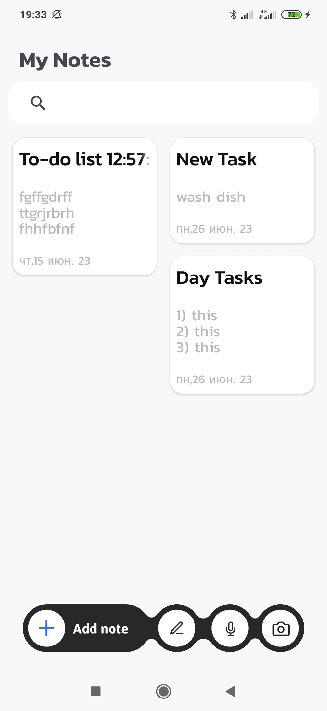
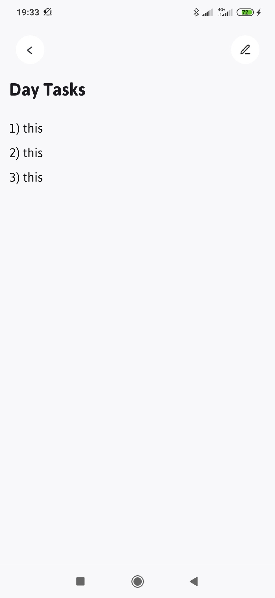

# Notes [MVVM, CRUD, ROOM]
This repository is made according to the course, to improve the skills of applying the pattern in practice

## Screenshots
Screenshot of each window

</img>
</img>

## Structure

#### Model
The model is presented in the form of  repository that provide suspend functions for receiving data
- `NotesRepository` - provides filters for photos

#### View
View are classic activities
- `Activity` 
  
#### ViewModel
ViewModel contain the logic of their screen
 - `NoteViewModel`
